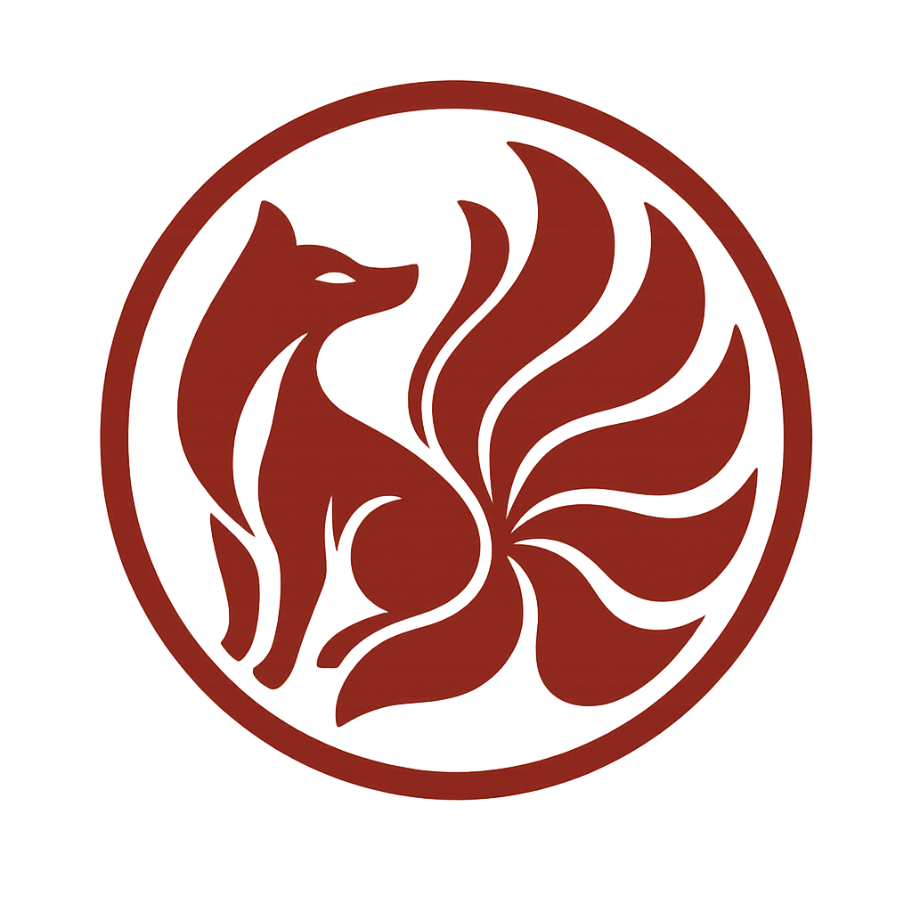

# zhenjun.qingzun - zjqingzun

## Introduction
__Scope of impact:__ Information Security   
__Conceptual role:__ Pentest, Code Audit  
__Type of group:__ White Team, Red Team (may include Purple Team)  
__Style of action:__ Full Disclosure (may include Responsible Disclosure)  
__Method of action:__ IAST  

## Favorite programming language
1. C/C++
2. Python
3. Rust
4. JavaScript
5. Shell

## Standards & Principles
Copyright © 2025 zjqingzun (zjqz-scyl-SPv1.0)  
  
