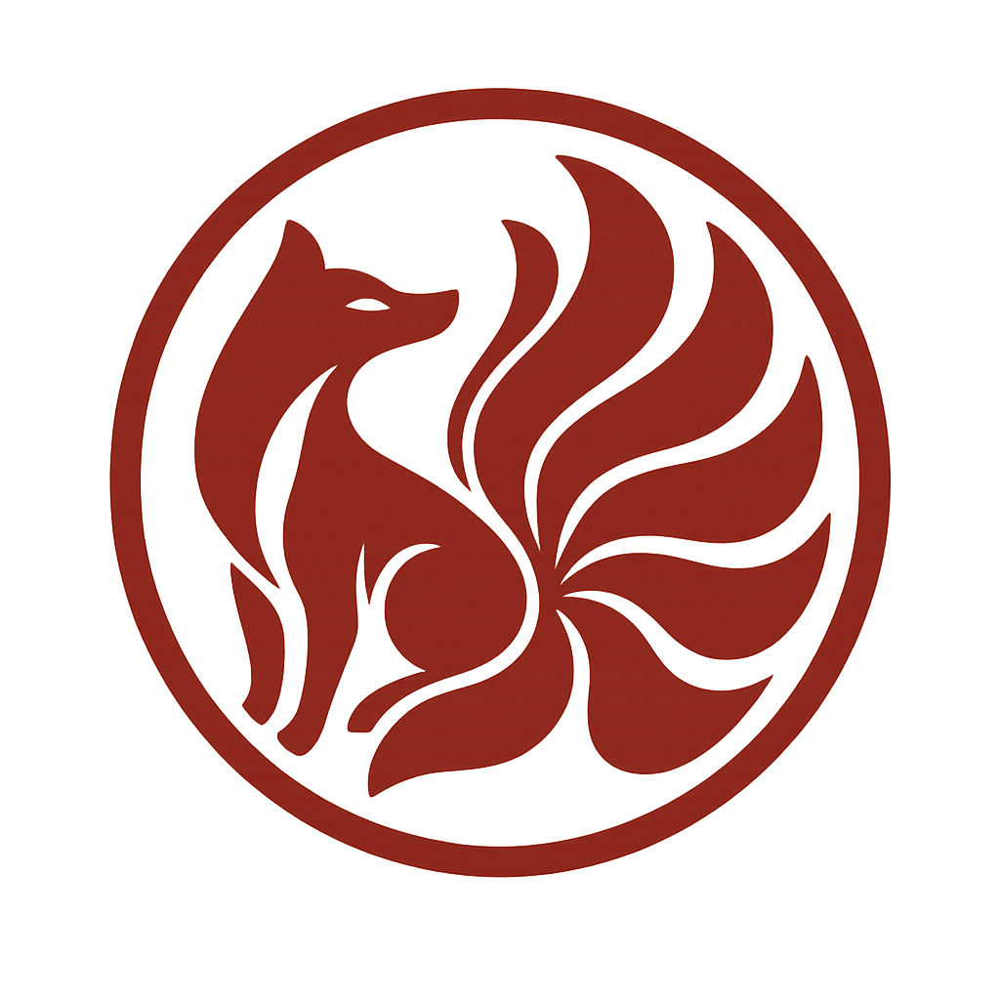

# zhenjun.qingzun - zjqingzun

## Introduction
__Work:__ Developer, Pentest, Code Audit  
__Field:__ Cybersecurity, Blockchain 

## Tech Stack
### Cybersecurity

### Blockchain

### Other

## Core Skills

## Standards & Principles
Copyright © 2026 zjqingzun (zjDSPF)  
  
